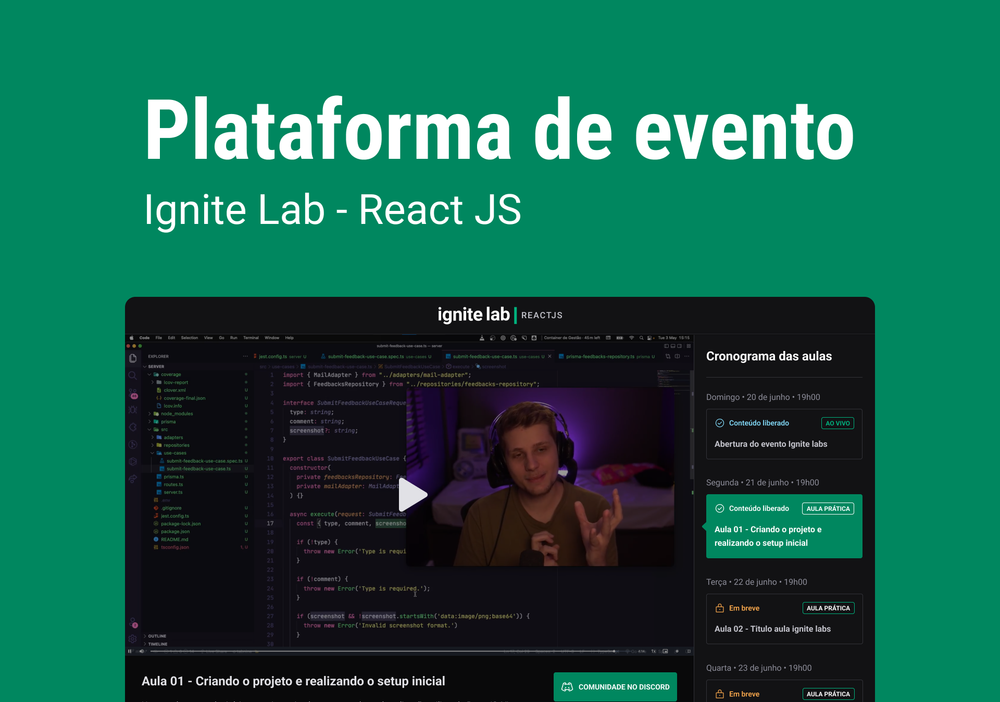

# Ignite Lab | ReactJS

## Descrição

Aplicação desenvolvido durante o Ignite Lab - ReactJS, promovido pela [Rocketseat](https://www.rocketseat.com.br/). Plataforma de evento online com data para liberação e exibição de video aula.

  

## Tecnologias

- [Vite](https://vitejs.dev/)
- [ReactJS](https://reactjs.org/)
- [TypeScript](https://www.typescriptlang.org/)
- [Tailwindcss](https://tailwindcss.com/)
- [GraphCMS](https://graphcms.com/)
- [GraphQL](https://graphql.org/)
- [Apollo](https://www.apollographql.com/)
- [react-router](https://v5.reactrouter.com/web/guides/quick-start)
- [phosphoricons](https://phosphoricons.com/)
- [vime](https://vimejs.com/)

---

2022 - [@fernandoprestes](https://github.com/fernandoprestes)
